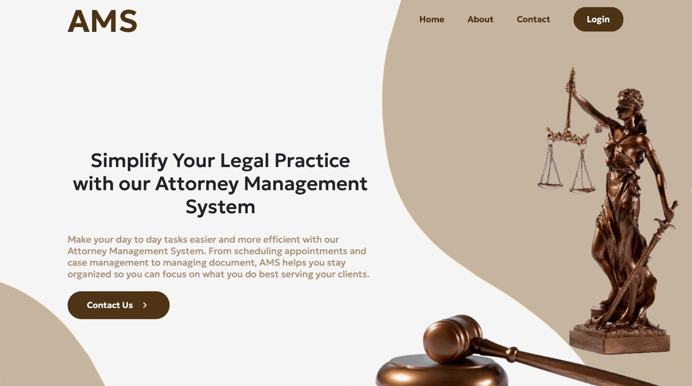
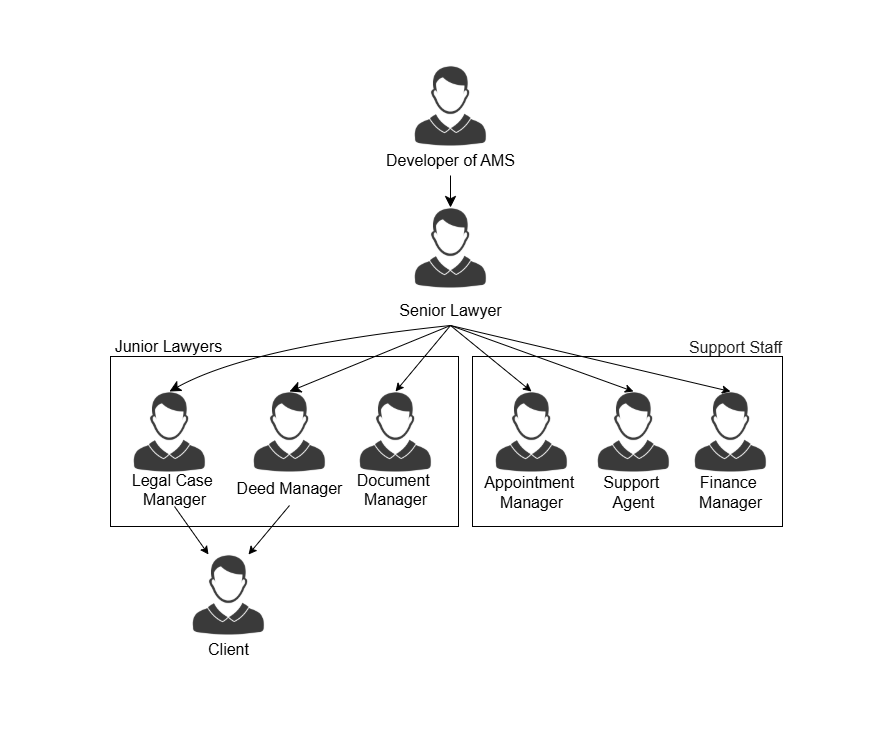
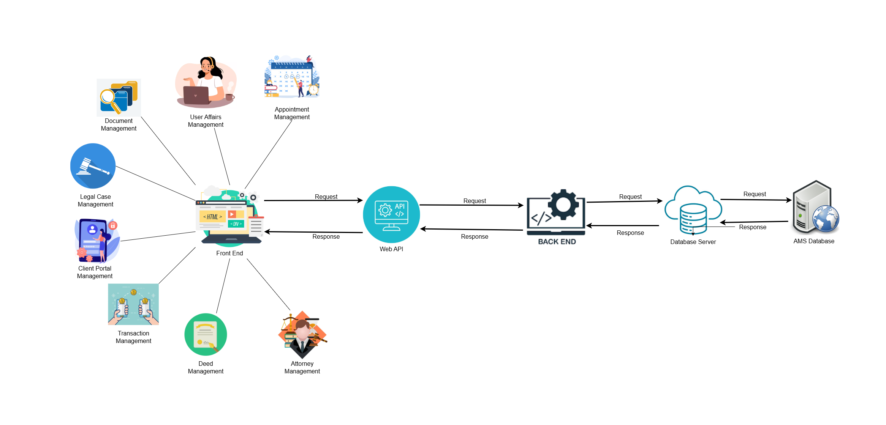
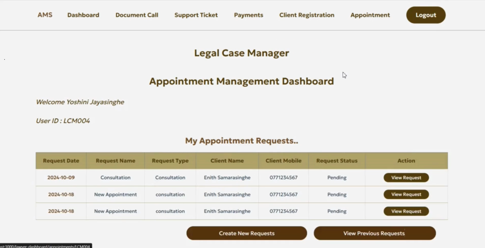
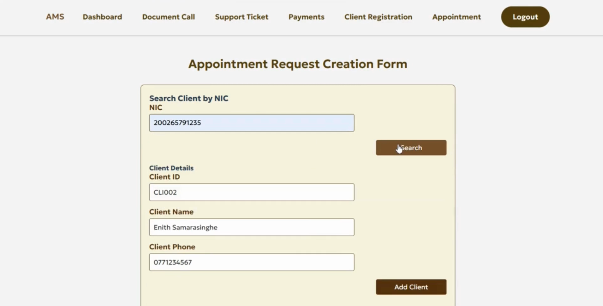
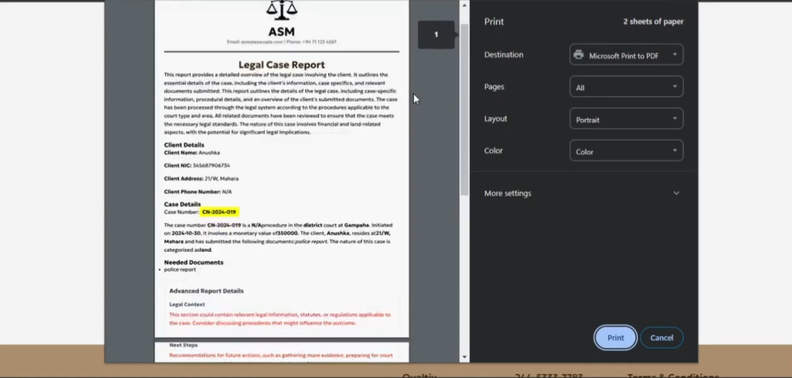

# Attorney Management System (AMS)

A comprehensive web-based legal practice management solution built with the MERN stack, designed to streamline law firm operations and enhance client-lawyer collaboration.

## Overview

The Attorney Management System is a full-featured platform that enables law firms to efficiently manage their operations, from case tracking and client management to document handling and billing. The system supports multiple user roles and provides a seamless workflow for legal professionals and their clients.



## Key Features

### Streamlined Case Management
- Intuitive interface for tracking case details, deadlines, and progress
- Easy assignment and monitoring of cases to specific attorneys
- Automated status updates and milestone tracking
- Court date scheduling and management

### Enhanced Client Management
- Comprehensive client database with detailed profiles
- Communication history tracking
- Billing and payment management
- Client portal for self-service access

### Advanced Document Management
- Secure document storage and organization
- Version control for legal documents
- Document sharing and collaboration tools
- Automated document request workflows

### Optimized Scheduling & Time Management
- Robust calendar system for appointments and court dates
- Integrated time-tracking for billable hours
- Automated reminders and notifications
- Deadline management

### Comprehensive Billing & Invoicing
- Automated invoice generation
- Payment tracking and management
- Financial reporting and compliance
- Integration with legal billing standards

### Data Security & Confidentiality
- Advanced security measures for sensitive information
- Role-based access control
- Compliance with legal data protection standards
- Audit trails and activity logging

### Analytics & Reporting Tools
- Case progress insights and metrics
- Attorney performance analytics
- Financial reporting and dashboards
- Customizable reports for strategic planning

### Lawyer-Client Matching
- Advanced search functionality for finding lawyers
- Filter by experience, expertise, and location
- Open platform for lawyer registration
- Enhanced accessibility to legal services


## System Architecture

### User Roles

1. **Senior Lawyer** - System administrator with full access
2. **Legal Case Manager** - Handles court cases and litigation
3. **Deed Manager** - Manages property deeds and conveyancing
4. **Document Manager** - Oversees document workflows and approvals
5. **Finance Manager** - Handles billing, payments, and financial transactions
6. **Appointment Manager** - Manages scheduling and appointments
7. **Support Agent** - Provides technical and user support
8. **Client** - End users accessing legal services




### Workflow Overview

1. **Firm Setup**: Developer creates firm profile and registers Senior Lawyer
2. **User Management**: Senior Lawyer registers and assigns roles to team members
3. **Case/Deed Creation**: Managers create cases or deeds and register clients
4. **Document Workflow**: Automated document requests and approval processes
5. **Appointment Scheduling**: Seamless appointment booking and management
6. **Financial Processing**: Payment requests, tracking, and verification
7. **Support System**: Ticket-based support with 24-hour response windows

## Technology Stack

- **Frontend**: React.js with modern UI/UX design
- **Backend**: Node.js with Express.js framework
- **Database**: MongoDB for flexible document storage
- **Authentication**: JWT-based secure authentication
- **Real-time Features**: Socket.io for notifications and updates



## Getting Started

### Prerequisites

- Node.js (v14 or higher)
- MongoDB (v4.4 or higher)
- npm or yarn package manager

### Installation

1. Clone the repository
```bash
git clone https://github.com/yourusername/attorney-management-system.git
cd attorney-management-system
```

2. Install backend dependencies
```bash
cd backend
npm install
```

3. Install frontend dependencies
```bash
cd ../frontend
npm install
```

4. Set up environment variables
```bash
# Create .env file in backend directory
cp .env.example .env
# Configure your MongoDB connection string and other variables
```

5. Start the application
```bash
# Start backend server
cd backend
npm start

# Start frontend development server
cd ../frontend
npm start
```






## User Experience

The system is designed with user-friendliness at its core:
- **Intuitive Interface**: Clean, professional design suitable for legal professionals
- **Responsive Design**: Works seamlessly across desktop, tablet, and mobile devices
- **Comprehensive Training**: Built-in help system and documentation
- **24/7 Support**: Integrated support ticket system for user assistance

## Security Features

- Role-based access control (RBAC)
- Data encryption at rest and in transit
- Secure authentication and session management
- Regular security updates and patches

## Benefits

- **Increased Efficiency**: Streamlined workflows reduce administrative overhead
- **Better Client Service**: Enhanced communication and transparency
- **Improved Compliance**: Built-in compliance features for legal standards
- **Cost Effective**: Reduced manual processes and improved resource allocation
- **Scalable Solution**: Grows with your firm's needs